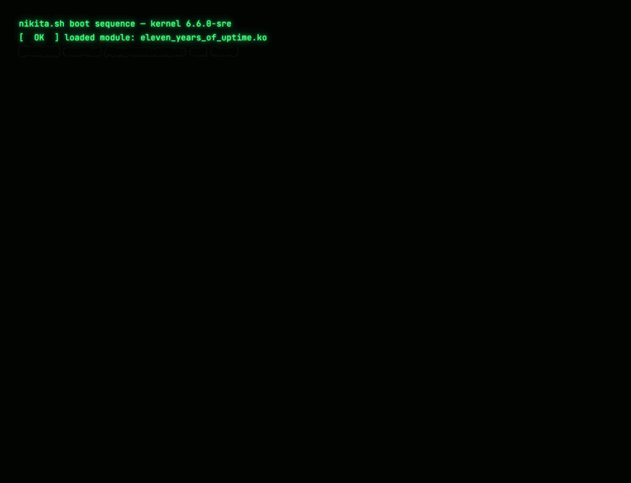
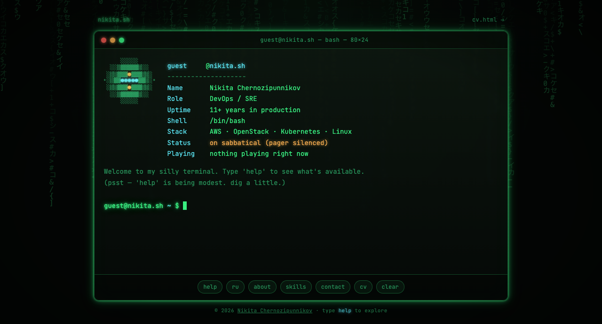
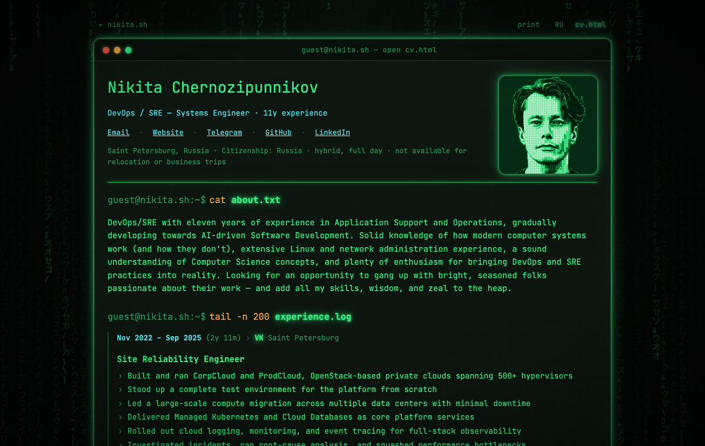
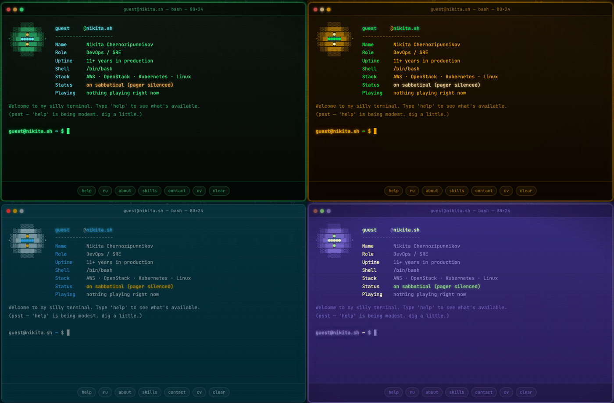
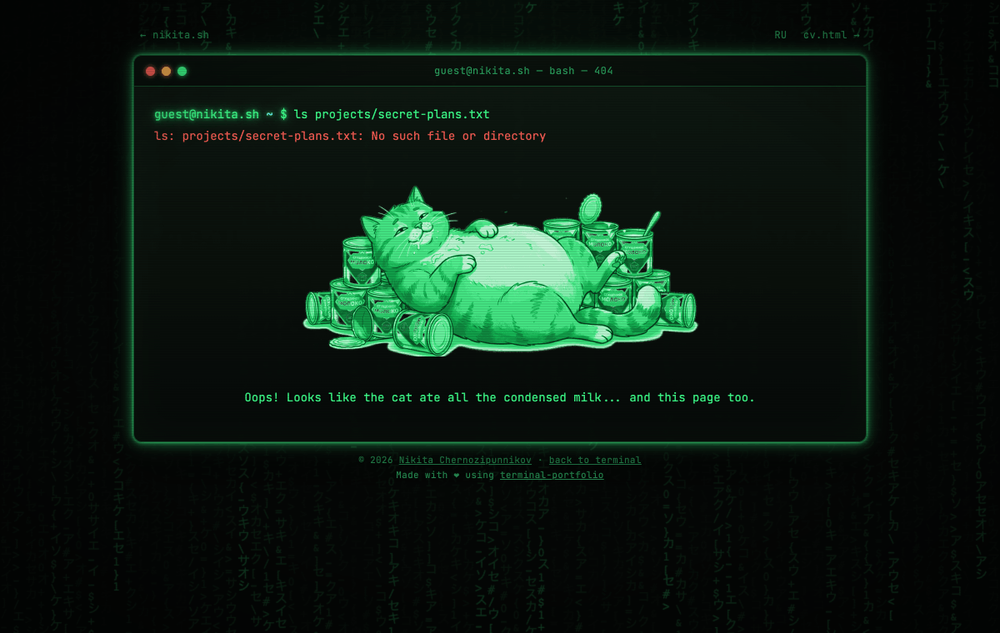

<div align="center">

# terminal-portfolio

**An interactive terminal portfolio you can fork for your own name, domain and CV.**
Vite + TypeScript, no UI framework, no runtime dependencies.

[](https://github.com/thatguynikita/terminal-portfolio/actions/workflows/ci.yml)
[](LICENSE)
[](package.json)
[](tsconfig.json)
[](vite.config.ts)
[](https://nikita.sh)



**[Try it live →](https://nikita.sh)**

</div>

---

## Features

- **One file per command.** Drop `src/commands/whatever.ts` in and it registers itself — `help`, Tab-completion and the touch chips all read the same registry, so they can't drift. → [guide](docs/commands.md)
- **38 commands, and 18 of them never show up in `help`.** `ls`, `cat`, `kubectl`, `terraform`, a fake `top`, an `ssh` persona that answers recruiter questions — plus a pile you have to find. The boot message warns you: *psst — 'help' is being modest.*
- **The hidden half is where the jokes are.** `sudo` reports the incident, deletes something precious, then admits it was kidding. `terraform destroy` warns it'll destroy your weekend. Ask `claude` for a light theme twice and it grudgingly ships you a secret one.
- **There's a game in here.** `ls -a` turns up a launcher script — `milk-quest.sh` on this site, whatever you name it on yours; running it is denied until you `sudo`. It opens in a CRT-tinted frame that picks up whatever theme you're on — the demo runs [condensed-milk-quest](https://github.com/thatguynikita/condensed-milk-quest), a vanilla-JS Canvas platformer.
- **Live "now playing" from Spotify** in the neofetch card. Backend setup is [spotify-now-playing](https://github.com/thatguynikita/spotify-now-playing) — or leave the endpoint blank and the row never renders and never makes a request.
- **7 themes**, one CSS file each, auto-registered. A random one greets each first-time visitor. → [guide](docs/theming.md)
- **A real fake filesystem** — files show up in `ls` with their true byte sizes, and can be dynamic or executable. → [guide](docs/filesystem.md)
- **A static CV**, prerendered per language, readable with JavaScript off and by AI crawlers that never run it. → [guide](docs/cv.md)
- **Built to be read by machines.** The résumé is in the raw HTML; the build emits `sitemap.xml`, `robots.txt` (with per-crawler rules and `Content-Signal`) and `llms.txt` from the same page list, plus a self-canonical hreflang cluster and JSON-LD. Scan it yourself with [Lighthouse](https://pagespeed.web.dev/) or [isitagentready.com](https://isitagentready.com/).
- **Thirteen languages ship, and adding one is a single file.** English, Russian, Ukrainian, Spanish, Portuguese, French, Italian, German, Polish, Turkish, Chinese, Japanese, Korean. You pick which ones build; the rest never reach the bundle. → [guide](docs/i18n.md)
- **Everything about you lives in one file** — `profile.config.ts`. Name, bio, skills, socials, CV, personas, SEO.
- **394 tests** and a config preflight, `npm run check`.
- **Deploys anywhere static** — GitHub Pages and S3-compatible hosts (AWS, Yandex Object Storage) are one command each; the S3 path sets every object's content type explicitly, with a dry run that shows the full plan first. → [guide](docs/deploy.md)

---

## Quick start

```bash
git clone https://github.com/thatguynikita/terminal-portfolio.git
cd terminal-portfolio
npm install
npm run dev                 # http://localhost:5173
```

Make it yours, then ship it:

```bash
cp profile.config.example.ts profile.config.ts   # start from a filled-in example
$EDITOR profile.config.ts                        # your name, bio, CV, socials
cp .env.example .env                             # then set SITE_URL to where it'll live
npm run check                                    # preflight — catches a half-done rebrand
npm run build                                    # typecheck, then build to dist/
npm run deploy                                   # publish to GitHub Pages…
npm run deploy:s3                                # …or to an S3 bucket (AWS, Yandex)
```

That's the whole loop. Everything below is detail.

> **GitHub Pages needs a custom domain** (or a `<user>.github.io` root site).
> `base` is fixed at `/`, so a project site at `<user>.github.io/<repo>/` would
> 404 on every asset. [Why, and how to change it →](docs/deploy.md#step-3-is-not-optional)

---

## Configuration

Edit **`profile.config.ts`**. That's the whole customisation surface: name, bio,
skills, socials, the neofetch card, ssh personas, hostname, languages, default
theme, whether the matrix rain starts on, SEO, and the entire CV.

Two filled-in examples ship alongside it, both fictional and both on `.example`
domains — copy either over `profile.config.ts` to start from something complete
rather than editing real data:

| File | Persona | Languages |
|---|---|---|
| `profile.config.example.ts` | data engineer | English |
| `profile.config.multilingual.example.ts` | robotics firmware engineer | English, Spanish, German |

```bash
cp profile.config.multilingual.example.ts profile.config.ts
```

The only structural difference between them is how many catalogues `MESSAGES`
imports. The trilingual one builds `/cv.html`, `/es/cv.html` and `/de/cv.html`
with a matching hreflang cluster, and its language chip cycles all three.

### The smallest config that builds

Only your name is required. Everything else either has a default or is a
feature that's simply absent when you leave it out:

```ts
// profile.config.ts
import { defineProfile } from "./src/core/profile";
import en from "./src/i18n/messages/en";

export const MESSAGES = { en };

export default defineProfile(MESSAGES, {
  author: { en: "Ada Example" },
});
```

That builds a green terminal at `guest@<your SITE_URL host>` with the boot
screen, the chip bar, the hidden commands and the ssh egg — and no `about`,
`skills`, `contact`, `neofetch` or `cv`, since there's nothing to show. `npm
run check` will warn that `seo.description` is unset (search engines then
write their own snippet); everything else is quiet. The examples show every
knob: the ones at their default are commented out with the default in the
comment, so uncommenting one is how you change it.

### Replace the images

Two of the shipped images are personal to the original author, and nothing
warns you at build time, so it's worth doing early:

| File | What it is | Size |
|---|---|---|
| `public/assets/img/portraits/` | the CV portrait — only the one `cv.photo` names is built | 480×480 |
| `public/assets/img/og-terminal.png` | the link-preview card, itself just a screenshot of the terminal | 1200×630 |
| `public/favicon.ico` + `public/assets/icons/*` | tab and home-screen icons | various |

**[Full guide → sizes, a script for the preview card, favicons](docs/assets.md)**

### The preflight

```bash
npm run check
```

It verifies every user-visible field is translated into every enabled language,
that referenced assets exist, that `SITE_URL` is a bare origin, and that social
links are real URLs. (`SITE_URL` itself is covered in [deployment](docs/deploy.md).)

It checks that images *exist*, not that they're *yours* — swapping the portrait
and the preview card is on you.

**This repo ships with the original author's real data**, so run it after
rebranding — `npm run deploy` runs it for you and refuses to publish if it fails.

---

## Customisation

Four extension points. Each is one file, and none of them need registering.

<details>
<summary><b>Add a command</b></summary>

```ts
// src/commands/coffee.ts
import { defineCommand } from "../core/types";

export default defineCommand({
  name: "coffee",
  complete: () => ["small", "large"],
  run: (ctx, args) => ctx.printText(`brewing a ${args.positional[0] ?? "small"}`),
});
```

Add `commands: { coffee: "make a coffee" }` to each locale in
`src/i18n/messages/` and you're done. `npm test` fails if you forget one.

**[Full guide → the output API, arguments, sub-shells](docs/commands.md)**

</details>

<details>
<summary><b>Add a file to the filesystem</b></summary>

Drop anything into `src/fs/`. It appears in `ls` with its real byte size and
`cat` prints it:

```
src/fs/projects.txt     →  ls, cat projects.txt
```

For files that are dynamic, translated or executable, add a `<filename>.ts`
descriptor beside it.

**[Full guide → descriptors, executables, non-text files](docs/filesystem.md)**

</details>

<details>
<summary><b>Add a theme</b></summary>

```css
/* src/themes/ocean.css */
:root[data-theme="ocean"] {
  --bg: #04121c;
  --fg: #7fdbff;
  /* ...every token green.css defines — nothing falls back... */
}
```

It joins the theme list, `theme`'s completions and the random first-visit pool
automatically. `npm test` fails if a token is missing.

**[Full guide → contrast, the CRT flicker, print](docs/theming.md)**

</details>

<details>
<summary><b>Add a language</b></summary>

```ts
// profile.config.ts
import en from "./src/i18n/messages/en";
import es from "./src/i18n/messages/es";

export const MESSAGES = { en, es };   // this map is the whole locale setup
```

Adding one makes TypeScript name every config field that still needs
translating, one error per field — so a half-translated site can't ship.

**[Full guide → catalogues, why unselected ones don't ship](docs/i18n.md)**

</details>

---

## What's in the box

| The terminal | The CV |
|---|---|
|  |  |
| 38 commands, Tab-completion, history, touch chips | Static per language, prints grayscale under any theme |

| Seven themes — four shown | The 404 |
|---|---|
|  |  |
| One CSS file each, random on first visit | Served at any depth, keeps your theme |

---

## Deploying

The build is a plain static `dist/` — any host works.

```bash
npm run deploy       # GitHub Pages
npm run deploy:s3    # AWS S3 or Yandex Object Storage; see .env.example
```

Both run the tests and the preflight first.

**[Full guide → Pages setup, DNS, S3, previewing without pushing](docs/deploy.md)**

---

## Scripts

| | |
|---|---|
| `npm run dev` | dev server with HMR |
| `npm run build` | typecheck, then build to `dist/` |
| `npm run preview` | serve the built `dist/` |
| `npm test` | full suite |
| `npm run test:watch` | suite in watch mode |
| `npm run check` | config preflight only |
| `npm run typecheck` | `tsc --noEmit` |
| `npm run deploy` | test, build, publish to GitHub Pages |
| `npm run deploy:s3` | test, build, sync to an S3-compatible bucket |
| `npm run deploy:s3:dry-run` | build, then print the upload/delete plan without touching the bucket |

---

## Layout

```
profile.config.ts       everything about you, including the whole CV
pages/                  the three page shells — Vite's root
src/core/               engine: registry, output API, input loop, modes, theme
src/commands/           one file per command — auto-registered
src/cv/                 CV renderer and URLs
src/fs/                 the fake filesystem
src/i18n/messages/      one file per language — en, ru, uk, es, pt, fr, it, de, pl, tr, zh, ja, ko
src/themes/             one CSS file per theme — auto-registered
src/styles/             shared chrome and per-page layout
public/                 copied verbatim into dist/
```

**[How it fits together →](docs/architecture.md)**

---

## Contributing

Issues and pull requests are welcome.

```bash
npm test          # before opening a PR
npm run typecheck
```

The conventions that matter: **one command per file**, command *logic* in
`src/commands/` and command *copy* in `src/i18n/messages/`, personal *data* only
in `profile.config.ts`. Any new visible text needs every enabled language — the
build fails otherwise, so you'll know.

Adding a theme? Check `--fg` against `--bg` for WCAG AA before opening the PR;
several published palettes don't pass.

---

## Credits

Rebuilt from [thatguynikita/nikita.sh](https://github.com/thatguynikita/nikita.sh),
where the whole terminal was a single 1,890-line inline `<script>` and
`runCommand()` was a 550-line `switch`. That repo is archived;
[nikita.sh](https://nikita.sh) is deployed from this one.

Shaped by three terminal portfolios worth reading:

- [iamdhakrey/terminal-portfolio](https://github.com/iamdhakrey/terminal-portfolio)
  — the README shape and the single-config-file approach
- [micahkepe/term-website](https://github.com/micahkepe/term-website/)
  — a minimal, configurable terminal website
- [satnaing/terminal-portfolio](https://github.com/satnaing/terminal-portfolio)
  — the terminal-as-portfolio idea, done in React

---

## Licence

MIT — see [LICENSE](LICENSE). Fork it, rename it, make it yours.
